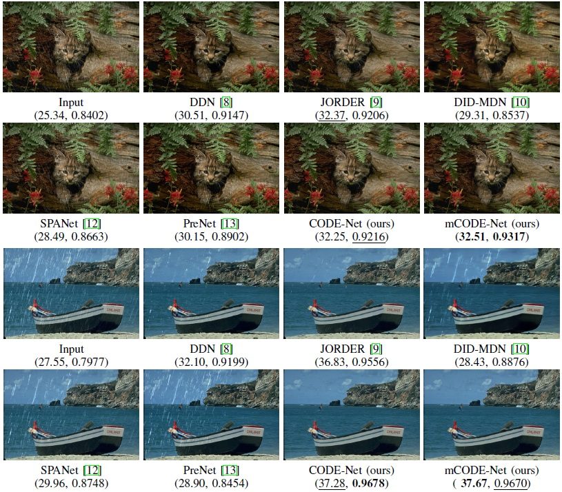

# Image Restoration :trumpet::trumpet::trumpet:(deraining ,desnowing, low-light enhancement and dehazing)

This repository is for RDL (Image Deraining with Density Estimation by Reweighting).

Codes will be published after acceptance. :smile:

    
   

    
Figure 1. Real deraining results on light, medium and heavy rain of our model, with the density estimation in the bottom (yellow: rainy inputs; blue: deraining results).

## Contents

* [Introduction](#introduction)

* [Dependencies](#dependencies)

* [Train](#train)

* [Test](#test)

* [Results](#results)
  * [Rain Density Estimation (RDE) by Weights](#rain-density-estimation-(rde)-by-weights)
  * [Qualitative Comparisons](#qualitative-comparisons)
  * [Quantitative Comparisons](#quantitative-comparisons)
* [Extensions](#extensions)
  * [Low-level ](#low-level )
    * [Desnowing](#desnowing)
    * [Low-light Enhancement](#low-light-enhancement)
    * [Dehazing](#dehazing)
  * [High-level](#high-level)
* [Acknowledgements](#acknowledgements)

## Introduction

The task of single image deraining is an ill-posed problem and thus very challenging even with deep learning methods. Furthermore, **the presence of non-uniform rain densities** makes the problem even harder to solve. In this paper, we propose to remove raining effects by reconstructing clean rain streaks using the framework of reweighted convolutional sparse coding (CSC). Specifically, through expressing the rain streaks by the CSC model, **the rain density can be adaptively estimated via the reweighted sparsity prior**.  Experiments on synthetic and real-world data demonstrate the superiority of our methods . In addition, **we also validate that our framework can benefit other low- and high-level vision tasks in extensions**.

 

    
   

 

    
Figure 2. Architecture of the proposed RDL.

## Dependencies
* Python 2 (Recommend to use [Anaconda](https://www.anaconda.com/distribution/#linux))
* [Pytorch 1.0.1](https://pytorch.org/)
* NVIDIA GPU + [CUDA](https://developer.nvidia.com/cuda-downloads)
* Python packages: pip install xxx

## Train
### Prepare dataset

We use 12000 and 1800 pairs of images from [DID-MDN](https://github.com/hezhangsprinter/DID-MDN) and [JORDER](http://www.icst.pku.edu.cn/struct/Projects/joint_rain_removal.html) as training set. For testing, two
commonly synthetic datasets, [Rain1200](https://github.com/hezhangsprinter/DID-MDN) and [Rain12](http://openaccess.thecvf.com/content_cvpr_2016/papers/Li_Rain_Streak_Removal_CVPR_2016_paper.pdf), and some real-world images are utilized

## Train

ToDO

## Testing

ToDO

## Results

### Rain Density Estimation (RDE) by Weights

The rain density is estimated **without any labels** in our model, instead of training an extra network in a supervised way to classify the rain density into three categories in DID-MDN [11]. Besides, thanks to the weights, our model is capable of **estimating the rain density with continuous states**, which is more suitable for real raining scenes than algorithms only classifying rain density into limited discrete states, for instance, DID-MDN.

    
   

    
Figure 2. A clear image (blue) and several samples (yellow) of different rain levels and corresponding RDEs.

### Qualitative Comparisons

    
   
    

       
 On synthetic images

    
  

 

On real-world images

### Quantitative Comparisons 

    
   

## Extensions

### Low-level vision tasks 

#### Desnowing

    

  

    

  

    

  

[More desnowing results](./figs/desnow/)

#### Low-light enhancement

    

  

    

  

    

  

    

  

[More low-light enhancement results](./figs/lowlight/)

#### Dehazing

    

    

    

[More deshazing results](./figs/dehaze/)

### High-level vision tasks

Object detection results with/without deraining. The labels and corresponding confidences are both given by [Google Vision API](https://cloud.google.com/vision/). (*left: rainy inputs; right: deraining results*)

    

  
  
 

**All of the above verify the effectiveness of our proposed method.**

## Acknowledgements

