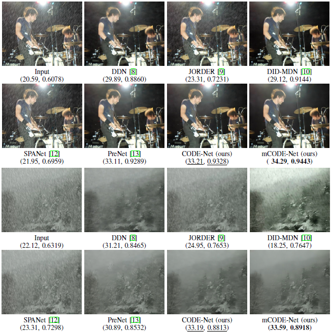
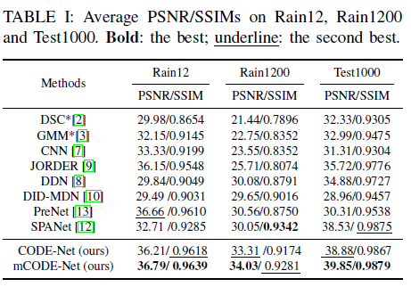

# This repository is for CODE-Net:trumpet::trumpet::trumpet:

**Single Image Deraining with Continuous Rain Density Estimation** :smile:

    
   

    
Figure 1. Deraining results on real images with light, medium and heavy rain (top) by SPANet (middle) and by our method (bottom).  Our method could produce more pleasant results. The rain density of each image is estimated by our method and indicated in read.

## Contents

* [Introduction](#introduction)

* [Results](#results)
  * [Rain Density Estimation (RDE) by Weights](#rain-density-estimation-(rde)-by-weights)
  * [Qualitative Comparisons](#qualitative-comparisons)
  * [Quantitative Comparisons](#quantitative-comparisons)
* [Extensions](#extensions)
  * [Low-level ](#low-level )
    * [Desnowing](#desnowing)
  * [High-level](#high-level)

## Introduction

Single image deraining (SIDR) often suffers from over/under deraining due to **the nonuniformity of rain densities and the variety of raindrop scales**. In this paper, we propose a **co**ntinuous **de**nsity guided network (CODE-Net) for SIDR. Particularly, it is composed of  a rain streaks extractor and a denoiser, where the convolutional sparse coding (CSC) is exploited to filter out noises from the extracted rain streaks. Inspired by  the reweighted iterative soft-threshold for CSC, we address the problem of continuous rain density estimation by learning the weights with channel attention blocks from sparse codes. We further exploit **a multiscale strategy to depict rain streaks appearing at different scales**. Experiments on **synthetic and real-world** data demonstrate the superiority of our methods over recent state-of-the-arts, in terms of both quantitative and qualitative results. Additionally, instead of quantizing rain density with several levels, our CODE-Net can provide **continuous-valued estimations of rain densities, which is more desirable in real applications**.

    
   

    
Figure 2. Architecture of the proposed CODE-Net.

## Results

### Rain Density Estimation (RDE) by Weights

The rain density is estimated **without any labels** in our model, instead of training an extra network in a supervised way to classify the rain density into three categories in DID-MDN. Besides, thanks to the weights, our model is capable of **estimating the rain density with continuous states**, which is more suitable for real raining scenes than algorithms only classifying rain density into limited discrete states, for instance, DID-MDN.

    
   

    
Figure 3. A clear image (blue) and several samples (yellow) of different rain levels and corresponding RDEs.

### Qualitative Comparisons

    
   
       

       
 Qualitative comparisons (PSNR, SSIM) of images from Rain1200 and Rain12.

    
  

 

Qualitative comparisons of real-world images, with the corresponding RDE calculated by our method.

    
  

 

More qualitative comparisons of real-world images.

**More deraining results on Rain1200/Rain12/Testing1000/RealImages  could be found in [BaiduNetdisk](https://pan.baidu.com/s/1crBm7pbjXfg3MiiCDbxWzA) (psw:nhra)**

### Quantitative Comparisons 

    
   

## Extensions

### Low-level vision tasks 

#### Desnowing

    

  

    

  

### High-level vision tasks

Object detection results with/without deraining. The labels and corresponding confidences are both given by [Google Vision API](https://cloud.google.com/vision/). (*left: rainy inputs; right: deraining results*)

    

  
  
 

**All of the above verify the effectiveness of our proposed method.**

